# Christian Ikirezi O814801

# Part 1. Personal Porfolio Building

## inspiration from https://dribbble.com/shots/16998552-Personal-Portfolio-Website/attachments/12077918?mode=media

## Home page

This page has my intro or summary showcasing what languages I can code in and some other contact information so that a visotr may reach me easily.

it also has naviagtion links to other pages like a cv page


## screenshot for Home Page

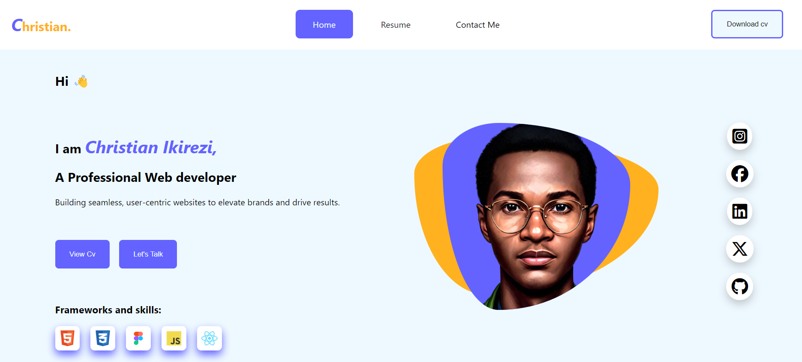

## a little bit of description here

I got an inspiration from one of dribble desgigns layering the header with grid colum template of the description, image and social Icon part.

I also added some box shadows on Icon so that they may look good for the design

```css
box-shadow: 0 8px 16px 0 rgba(0, 0, 0, 0.2);
```

## The icon!

The icon is simply my name styled with font-size and changing some colors of a part of the text

```html
<h1 class="logo"><em>C</em>hristian.</h1>
<style>
  .logo {
    color: #ffb11f;
  }
</style>
```

## The buttons and Hover effect

The hover effect is on each link and button, its hard to screenCapture this, but when the page chnages this blue button becomes inactive and the visted page link becomes active active instead.

### On home page

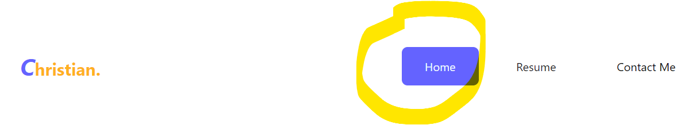

### On Resume page

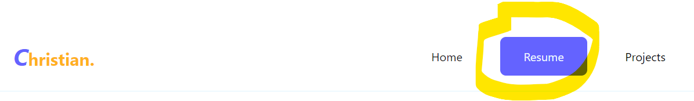

## The profile image

For the profile image I used my AI generated Image, it looks way more cooler, ten added a div at back to style the background with a good border radius and colors

```css
.body-container .image-section img {
  width: 70%;
  align-self: center;
  border-radius: 30% 70% 70% 30% / 23% 33% 67% 77%;
  background: var(--secondary-background);

  z-index: 2;
}

.image-section .back-edit {
  z-index: 1;
  height: 60vh;
  width: 30%;
  position: absolute;
  border-radius: 30% 70% 70% 30% / 23% 33% 67% 77%;
  background: #ffb11f;
  transform: rotateX(45deg);
}
```

## The Project Home page Section

This project simply showcase two of my ongoing projects that I have been working on using Figma, Html, Js and css

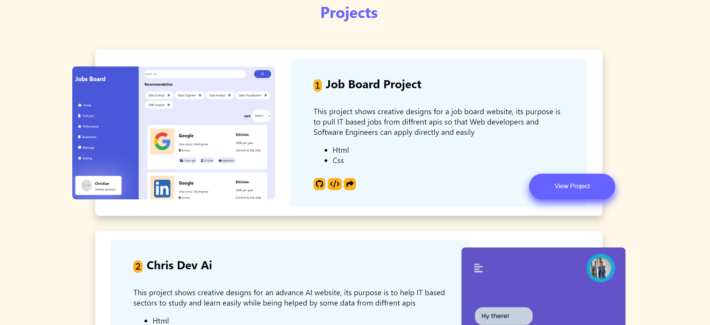

The design is simple but appealing because i used (-ve) em values to make sure the project image and button are abit out of the main card as see.

```css
.projcard-container img {
  border-radius: 0.5em;
  width: 40%;
  margin-left: -3em; //this one
  height: 40vh;
}
```

## Footer

the footer is familiar, i used Grid template to display its elements but chnaged it to flex in the media querry so that it can be responsive

## To make home page responsive

To make this responsive I have used media querries to reflect to diffrent screen sizes such as Phones, Tbles and Laptops as well

### Screenshot for phone

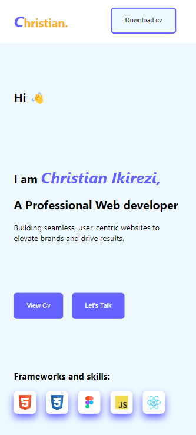

### Screenshot for for tablets

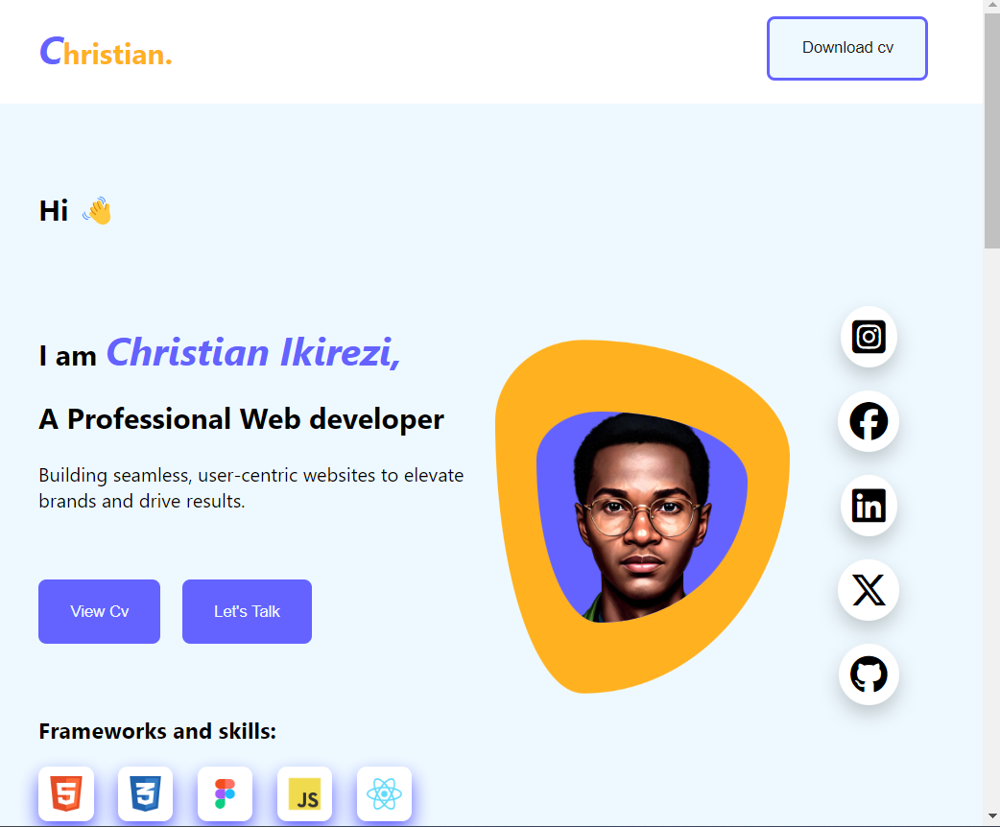

To achieve this i used these simple css media querry methods

## Second page is the page of my Resume

### Here are Screenshots for wide screen view

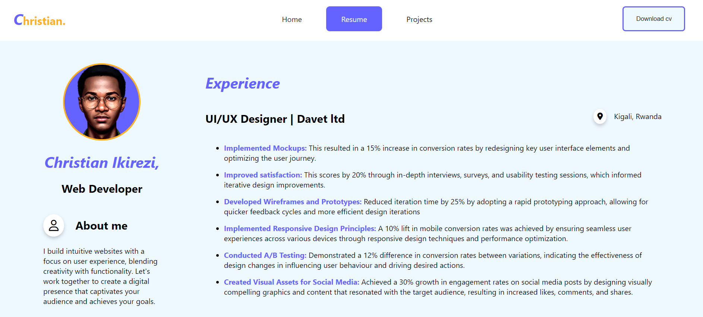
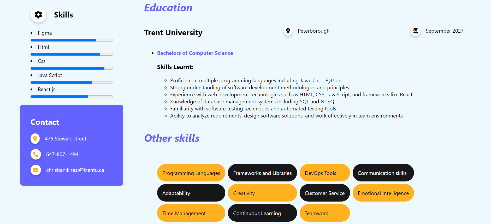

### Mobile view

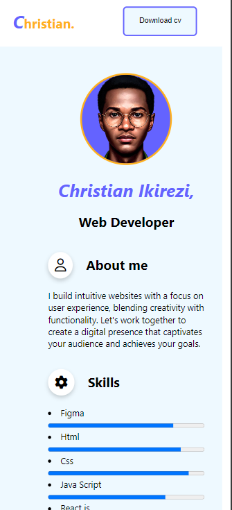

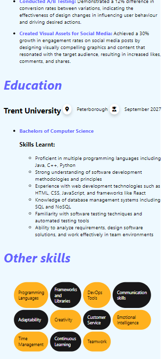

As seen my media Querries are adaptive to the screen of any device

## Browser Compativbility

My normal browser is chrome, almost all used tags are supported by ohter browsers like mozilla fire fox, microsoft edge and others.

But for Progress Bar it required me to use

```css
progress {
  width: 100%;
}
progress::-webkit-progress-value {
  width: 100%;
}
```


## color palette used

I just used simple color palette to make my portfolio look pretty, too much of colors looks bizzare!

```css
:root {
  --primary-color: #181718;
  --secondary-color: #9f9ca2;
  --primary-background: #eef9ff;
  --secondary-background: #6463ff;
}
```
## accessibility testing

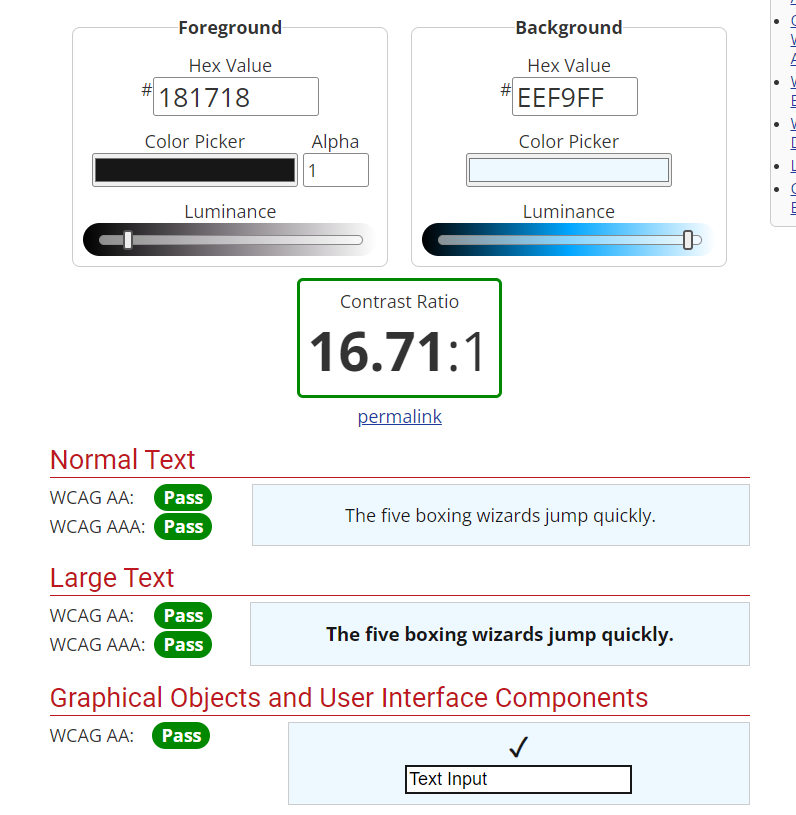
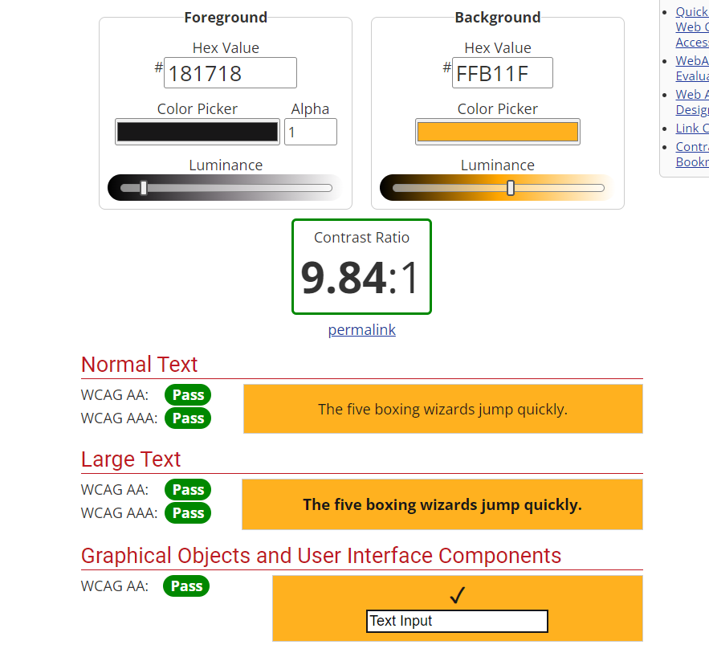

